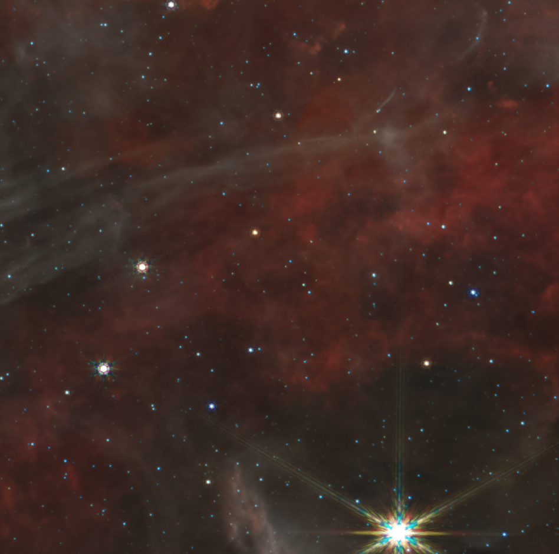
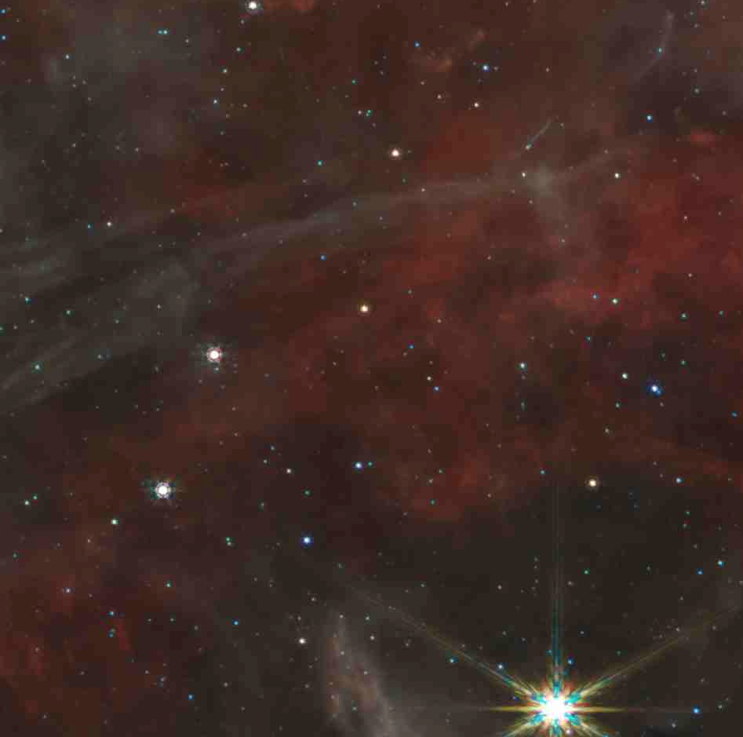

# ML-based compression

My sandbox for playing with AI-based lossy compression algorithms.

Note: code here is mostly in a "note to self" format, and is just me playing with Torch, CompressAI and image processing, then writing things down for my future self.

## Motiviation

I've gotten the idea from [DrDub's wiki](http://wiki.duboue.net/Neural+Image+Compressor):

> The idea would be to use a JavaScript deep learning framework (such as TensorFlow.js), split an image into tiles, train a single autoencoder to produce codes for each tile (or use a convolutional autoencoder), then compress the image as the decoder side of the autoencoder plus the codes for each tile. This technique trades transfer size with decoding time

## Theory

In short, compression is based on an idea that most content contains redundant information which can be removed, reducing the size. Lossy compression is a compression where some loss of quality is acceptable, as long as perceptive  quality doesn't suffer significantly. Classic algorithms such as DCT used in JPEG use a handcrafted linear transformation into a latent space, followed by removal of the non-important components.

The idea of AI-based compression is to replace a hand-crafted algorithm with automatically optimised solution, which opens up a way for hyper-specialised compression models that could perhaps compress small groups of images.

## Existing solutions

The 2016 "End-to-end optimized image compression" paper https://arxiv.org/pdf/1611.01704.pdf largely paves the way for trained non-linear compression. Authors show how to train an autoencoder for this task: unlike the usual AE bottleneck which limits available dimensions, here the bottleneck limits entropy. Loss is set as a composite of rate and distortion, which can then be traded off to reach desired quality.

Entropy bottlenecks have since been implemented in:

* [TensorFlow Compression](https://github.com/tensorflow/compression)
* [Third-party library for torch](https://github.com/InterDigitalInc/CompressAI)

READMEs in this repos contain a wealth of information about lossy AI compression.

An interesting side-note is that to make general models, Compress AI says:

> networks were trained for 4-5M steps on 256x256 image patches randomly extracted and cropped from the Vimeo90K dataset. [--CompressAI docs](https://interdigitalinc.github.io/CompressAI/zoo.html)

## This repo

Here, I play with CompressAI's package to see if I can compress a single tiled image, trying to beat original JPEG. Note this is deliberately easy setup:

* The image I'm using hasn't got many features (deep-space image of a starfield)
* I'm comparing with an algorithm from previous century (JPEG)
* I'm not trying to create a generalised algorithm.
  
## Data

You can grab the data image from [NASA](https://stsci-opo.org/STScI-01GA76Q01D09HFEV174SVMQDMV.png). It's an image of Tarantula Nebula, 20 Doradus, 30 Dor, NGC 2070 (from the Space Telescope Science Institute Office of Public Outreach).

## Results

Not peer reviewed, consider rough.

The bpp results are based on compressing tiled image into bytes, storing these on disk in parquet format (with compression disabled, to deal with tiles), then measuring size, then decompressing from parquet and reassembling to present the result visually as PNG. Models were saved simply by using `torch.save`, without compression.

| name       | psnr↓ | ms-ssim  | factor | bpp  | model size on disk |
| ---------- | ----- | -------- | ------ | ---- | ------------------ |
| **orig**   | inf   | 1.000000 | 1.0000 | 9.53 | 0                  |
| jpeg95     | 40.87 | 0.990100 | 0.1568 | 1.49 | 0                  |
| 03c        | 37.69 | 0.979726 | 0.0187 | 0.18 | 476,821            |
| jpeg70     | 37.24 | 0.973139 | 0.0416 | 0.40 | 0                  |
| 03e        | 36.41 | 0.971706 | 0.0146 | 0.14 | 1,782,933          |
| jpeg50     | 36.36 | 0.963297 | 0.0299 | 0.29 | 0                  |
| 04a        | 34.95 | 0.980841 | 0.0241 | 0.23 | 578,197            |
| **04b**    | 34.40 | 0.973757 | 0.0168 | 0.16 | 578,197            |
| **jpeg20** | 34.05 | 0.922156 | 0.0189 | 0.18 | 0                  |
| 03d        | 33.96 | 0.961352 | 0.0133 | 0.13 | 1,782,933          |

Below is a comparison of [test-jpeg20.jpg](artifacts/test-jpeg20.jpg) vs [test-04b.parquet](artifacts/test-04b.parquet). Note both are presented as PNG captures of a section of the original, to faithfully reproduce artifacts. 

You can see the tradeoff is hard to compare: PSNR is close, but 04b has a vastly better MS-SSIM. Visually, JPEG20 is blocky, but reproduces colors faithfully, while 04b is less blocky, but has odd colors and tile edges are somewhat visible.

### Original fragment

### JPEG quality 50

### 04b

## Interim conclusions

The tradeoff presented here makes no sense: the model size is way too big, the savings are way too small, and qualitative comparison doesn't stack up against JPEG (which is optimised for human perception).

Perhaps with enough perseverance, a tradeoff exists that would produce a fit-for-purpose solution. There is many areas to experiment with:

* the usual hyperparameter zoo: losses (MSE, MS-SSIM), tile sizes, tile counts, bpp weights, gradient clipping, learning rates
* one could preprocess images into a better color space (for example chroma variability doesn't affect the quality as much as luma, and working with RGB might not be the most optimal).
* use more sophisticated models beyond the 2016 original concept (see e.g. [model zoo](https://interdigitalinc.github.io/CompressAI/zoo.html))

Even if a good tradeoff was found, there is no immediately usable solution and significant further steps would be required to demonstrate viability:

* JS model running on the browser browser (even if using a generic model exporter, would still need a JS implementation of decompression algorithm and the custom file format handling)
* Better reconstruction strategy (currently edges are somewhat visible, and are handled with overlapping the tiles and discarding edges)
* Metadata storage (to include reconstruction size, tile size etc)
